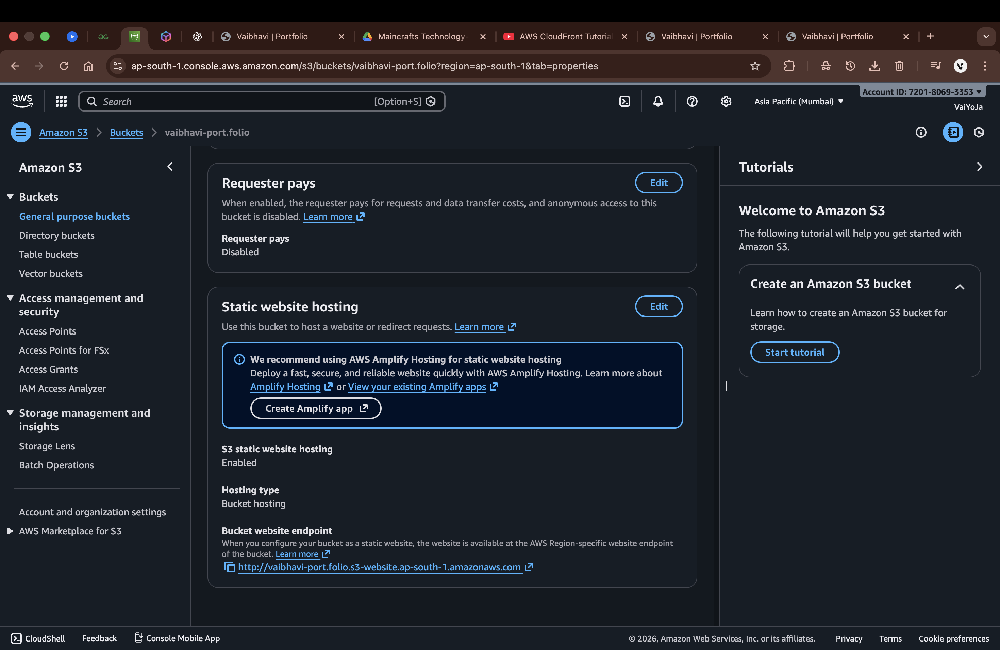
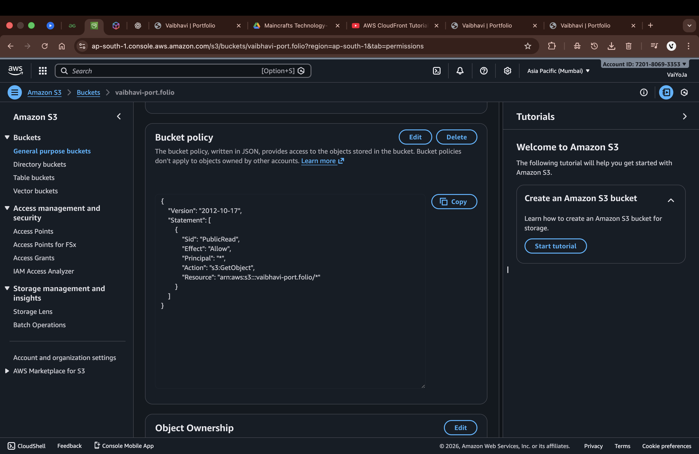
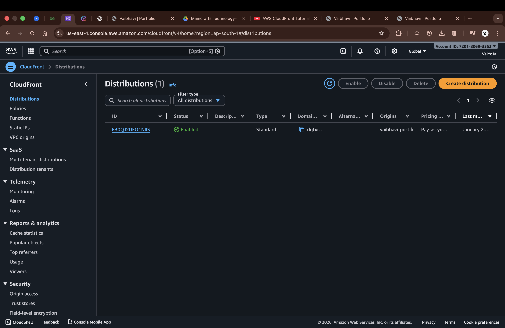
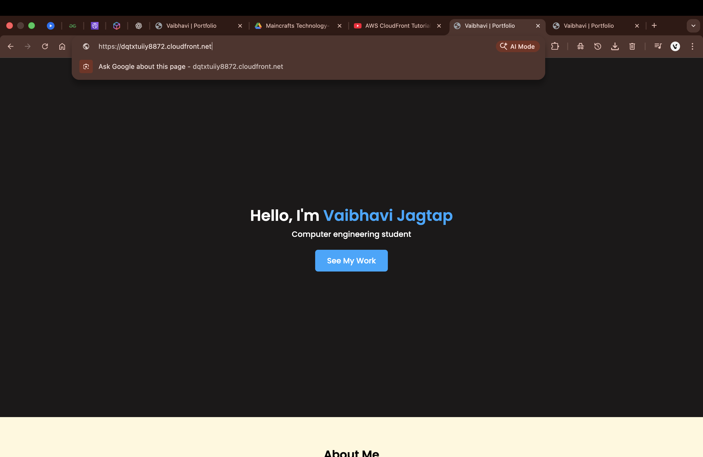

Static Portfolio Website using AWS S3 and CloudFront

📌 Project Overview
This project is a responsive single-page portfolio website built using HTML and CSS.  
The website is hosted on **Amazon S3** and delivered securely using **Amazon CloudFront** with **HTTPS** enabled.

This project was completed as part of **Cloud Computing & DevOps – Task 1** to gain hands-on experience with cloud storage, static website hosting, CDN configuration, and secure content delivery.

🛠️ Technologies Used
- HTML
- CSS
- Amazon S3 (Static Website Hosting)
- Amazon CloudFront (CDN & HTTPS)
- Git & GitHub

🎯 Features
- Responsive single-page layout
- Hero section with call-to-action button
- About, Projects, and Contact sections
- Three project cards
- Google Fonts and FontAwesome icons
- HTTPS-enabled using CloudFront

🚀 Deployment Steps
1. Created an Amazon S3 bucket and disabled Block Public Access.
2. Uploaded static website files (`index.html`, `styles.css`).
3. Enabled static website hosting with `index.html` as the index document.
4. Added a bucket policy to allow public read access.
5. Created a CloudFront distribution with the S3 bucket as origin.
6. Configured CloudFront to redirect HTTP to HTTPS.
7. Tested and verified the live website using the CloudFront URL.

🌐 Live Demo
- CloudFront URL: https://dqtxtuiiy8872.cloudfront.net/  
- GitHub Repository: https://github.com/vaiyoja/Main_Portfolio

📸 Screenshots Included
- S3 Static Website Hosting configuration
  
  
- S3 Bucket Policy
  
  
- CloudFront Distribution (Deployed status)
  
  
- Live website running on HTTPS
  

📚 Learning Outcomes
- Understanding Amazon S3 static website hosting
- Applying bucket policies and public access settings
- Configuring CloudFront for CDN and HTTPS
- Basic DevOps deployment workflow
- Using GitHub for version control and project sharing

👩‍💻 Author
Vaibhavi Jagtap  

